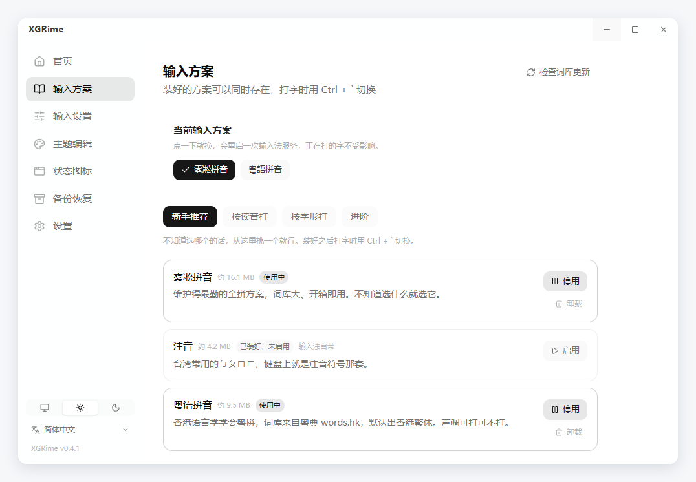
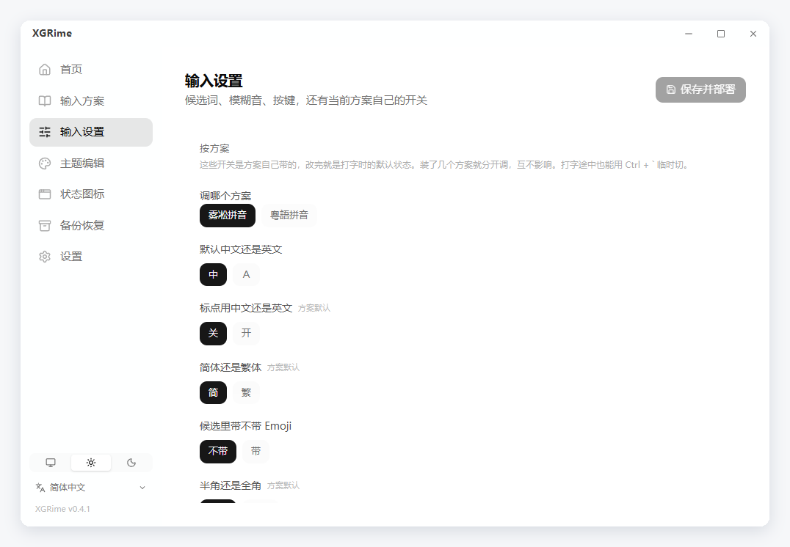
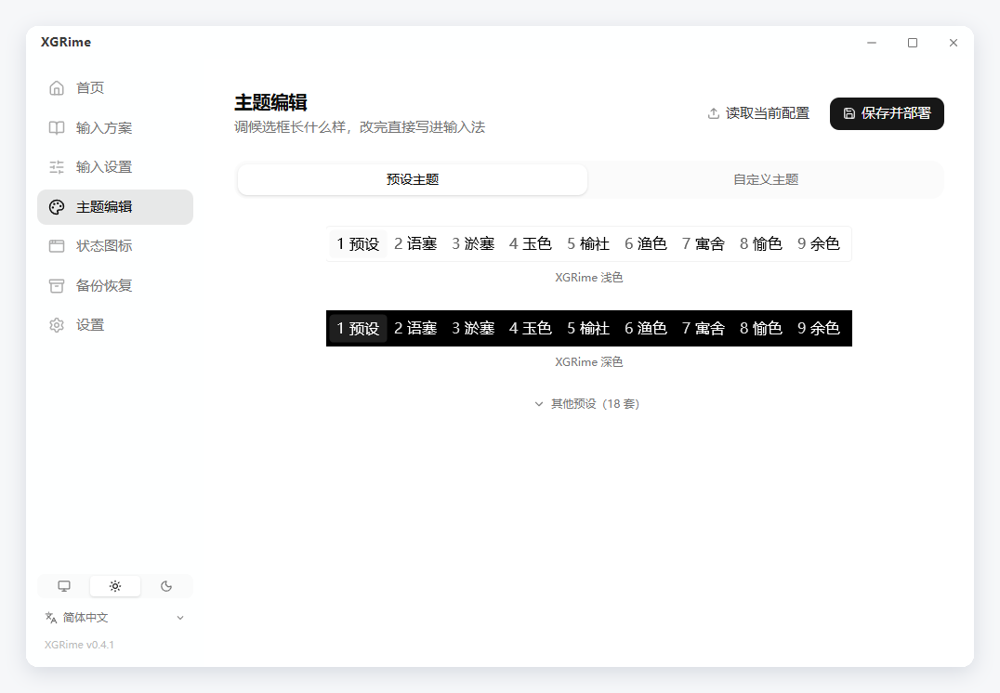
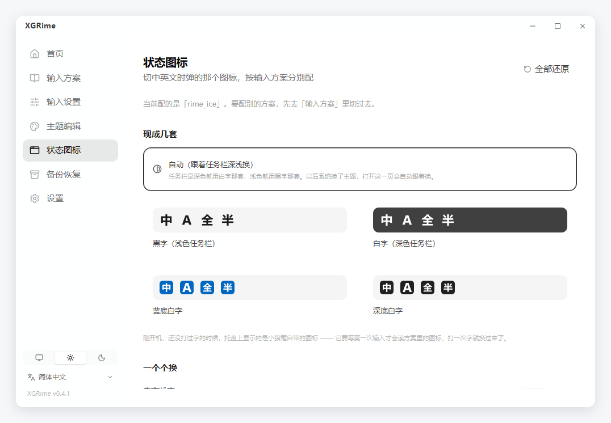
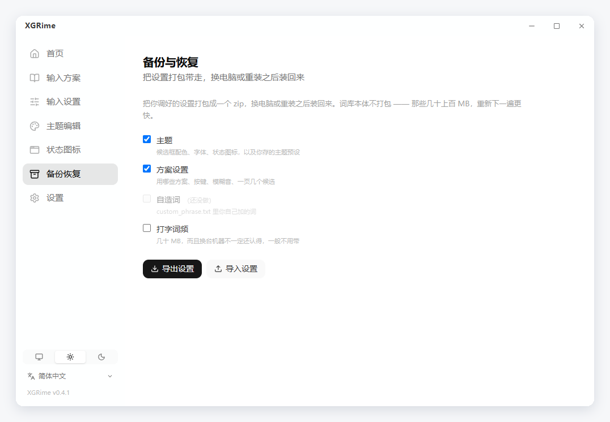

[English](README.md) | 官话 - 简体中文 | [官話 - 繁體中文](README-cmn_TW.md) | [廣東話](README-jyut.md)

<br>

<p align='center'>
  
</p>

<h1 align='center'>XGRime</h1>

<p align='center'>
  <samp>RIME 输入法的图形配置工具 —— 装输入法、挑输入方案、调外观，点几下就好</samp>
</p>

<p align='center'>
  
  
  
  
  
  
  
</p>

<p align='center'>
  <a href="https://github.com/XXGGG/XGRime/releases/latest"><b>下载最新版</b></a>
</p>

<br>

## 👋 简介

RIME 是桌面上最能打的输入法引擎之一，但它的配置全靠手写 YAML —— 换个输入方案要自己
下载词库，调个候选框颜色要翻文档里的十几个键名。

XGRime 把这些接管过来：**安装输入法、挑输入方案、调按键习惯、改候选框外观**，
全部在图形界面里完成，配置文件由它替你写。

支持 Windows 的**小狼毫（Weasel）**和 macOS 的**鼠须管（Squirrel）**。

<div align="center">
  
</div>

## ✨ 功能

### 安装与维护

- 自动检测输入法装没装，没装可一键下载官方安装包并启动安装
- 官方发布新版本时提示更新
- 可以卸载输入法，也可以把卸载后残留的旧配置备份归档

### 28 个输入方案

| 分类 | 方案 |
|---|---|
| 普通话 | 雾凇拼音、薄荷拼音、明月拼音、袖珍简化字拼音、地球拼音 |
| 双拼 | 小鹤、微软、自然码、智能 ABC、拼音加加 |
| 粤语 | 粤语拼音（词库来自粤典 words.hk）、耶鲁粤拼、香港教院式 |
| 注音 | 注音、注音 · 臺灣正體 |
| 字形 | 五笔 86、五笔 · 拼音、仓颉五代、速成、快速仓颉、五笔画、行列 30 |
| 进阶 | 上海吴语、苏州吴语、中古全拼、X-SAMPA 音标、宫保拼音 |

- 按「按读音打 / 按字形打 / 进阶」分层，新手在推荐区三选一即可
- 一键安装，方案依赖的词典会一起装齐并自动启用
- 随时启用、停用、卸载；可检查词库有没有更新

<div align="center">
  
</div>

### 输入设置

- 候选词个数、翻页键、左右 Shift 键行为
- 模糊音 11 组（zh/z、n/l、an/ang 等）
- 方案自带的开关：简繁字形、中英标点、Emoji 候选等，有几个显示几个
- 装了多个方案时分别配置，互不影响

<div align="center">
  
</div>

### 外观

- **20 套预设**：出厂两套（XGRime 浅色 / 深色），另有小狼毫官方配色（碧水、墨池、
  孤寺、暗堂、晒经石、星际争霸）、微软输入法风格、macOS 原生、Windows 11、紧凑、
  竖排经典，以及 Nord、Dracula、Tokyo Night、Catppuccin
- 预设的缩略图**是小狼毫真画出来的候选框截图**，不是示意图
- 配色、字体、字号、圆角、边距、宽度全部可调，调好的可以存成自己的预设
- 切换中英文时弹出的提示可以关掉或调短

<div align="center">
  
</div>

### 状态图标

- 内置四套「中 / A / 全 / 半」：黑字、白字、蓝底白字、深底白字
- **自动**：任务栏深色就用白字那套、浅色就用黑字那套，开机时自动对一次
- 四个状态也可以各自换成自己的图片

<div align="center">
  
</div>

### 备份与恢复

- 把主题、方案设置、状态图标、存下的预设打包成一个 zip，换电脑或重装之后装回来
- 词库本体不打包 —— 那些几十上百 MB，重新下一遍更快
- 导入前先读包里的清单弹确认；被覆盖的文件会先抄一份留在配置目录

<div align="center">
  
</div>

### 托盘与设置

- 关窗口只收进托盘不退出；点托盘图标能换输入方案、重新部署
- 开机自启；Windows 上可以一键打开系统的「高级键盘设置」

### 界面

- 简体中文、繁體中文、廣東話、English，第一次打开跟随系统语言
- 跟随系统 / 浅色 / 深色

## 💡 有什么不一样

**不会把你的设置弄丢。** XGRime 只写属于自己那一层配置，从不覆盖输入法或词库自带的
文件。升级输入法、更新词库之后，你调过的东西都还在。

**装完就能用。** 输入方案常常依赖别的词典，少一本部署就会失败。XGRime 会把依赖一并
装齐、自动挂进方案列表，装完直接切过去就能打字。

**看到的就是真的。** 主题预设的缩略图不是画出来的示意图 —— 每一套都真的部署了一遍，
再把小狼毫自己画出来的候选框抓下来。挑的时候看到什么，用起来就是什么。

## 🚀 开始用

1. 到 [Releases](https://github.com/XXGGG/XGRime/releases/latest) 下载安装包并安装
2. 打开 XGRime，在**首页**装上小狼毫 / 鼠须管（已经装过会自动认出来）
3. 到**输入方案**挑一个，新手在推荐区三选一就行
4. 装了多个方案的话，在**输入方案**页顶上点一下就能换；打字时也可以按
   <kbd>Ctrl</kbd> + <kbd>`</kbd> 切

系统要求：Windows 10/11 或 macOS 12+。

## 🛠 从源码构建

```bash
pnpm install
pnpm tauri dev      # 开发
pnpm tauri build    # 打安装包
```

需要 Node.js 18+、pnpm 和 Rust 1.77+。Windows 另需 MSVC 生成工具与 WebView2
（Windows 11 自带）。

## 📁 项目结构

```
src/views/                  首页 / 输入方案 / 输入设置 / 主题编辑 / 状态图标 / 备份恢复 / 设置
src/components/theme/       取色、字体、预设、布局
src/assets/presets/         预设缩略图，由 scripts/shoot-presets.py 真机抓出来
src/i18n/locales/           简 / 繁 / 粵 / EN 四份，构建时校验键一一对应
src-tauri/src/platform.rs   Windows / macOS 抽象层：检测、配置目录、部署
src-tauri/src/dict.rs       方案清单与依赖、下载解压、启用停用
src-tauri/src/settings.rs   输入设置与方案开关
src-tauri/src/config.rs     外观配置的读写
```

## 🙏 致谢

**上游** —— [RIME / 中州韵输入法引擎](https://rime.im)，以及
[小狼毫 Weasel](https://github.com/rime/weasel) 和
[鼠须管 Squirrel](https://github.com/rime/squirrel)。XGRime 只是给它们做配置。

**输入方案** —— [雾凇拼音](https://github.com/iDvel/rime-ice)、
[薄荷拼音](https://github.com/Mintimate/oh-my-rime)、
[粤语拼音](https://github.com/rime/rime-cantonese)，以及官方的 `rime/rime-*`
方案仓库。词库在安装时下载，未打包进本仓库。

**技术栈** —— [Tauri](https://tauri.app)、[Vue](https://vuejs.org)、
[Tailwind CSS](https://tailwindcss.com)、[Pinia](https://pinia.vuejs.org)、
[VueUse](https://vueuse.org)、[Lucide](https://lucide.dev)。

README 版式参考 [vitesse](https://github.com/antfu-collective/vitesse) 与
[BewlyBewly](https://github.com/BewlyBewly/BewlyBewly)，只参考版式，未使用其代码。

## 许可协议

本项目采用 [MIT](LICENSE) 许可协议。

Copyright © 2026 [Xie Xiage](https://github.com/XXGGG)
