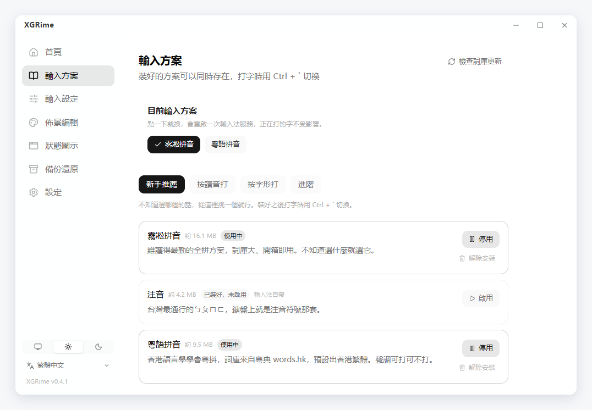
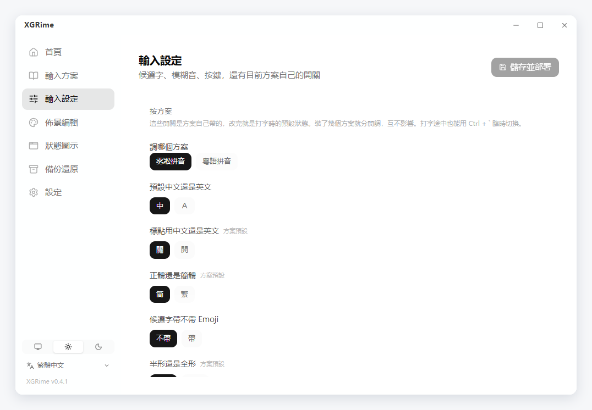
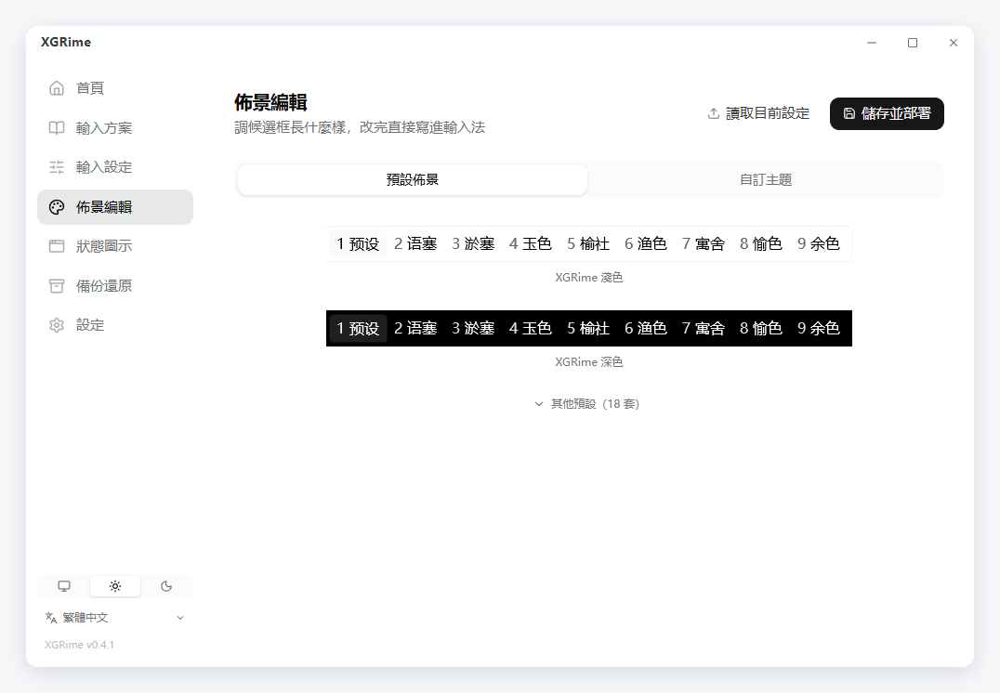
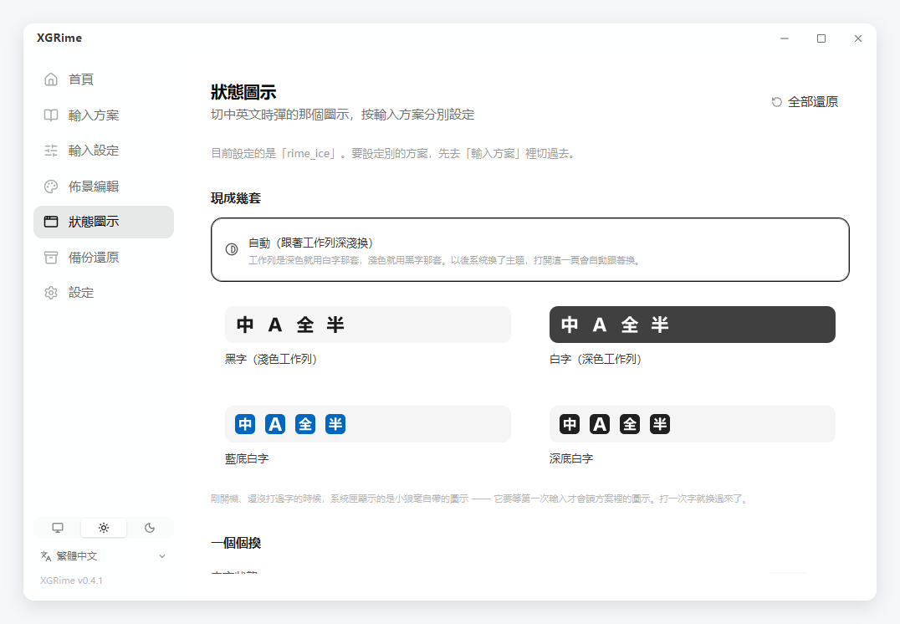
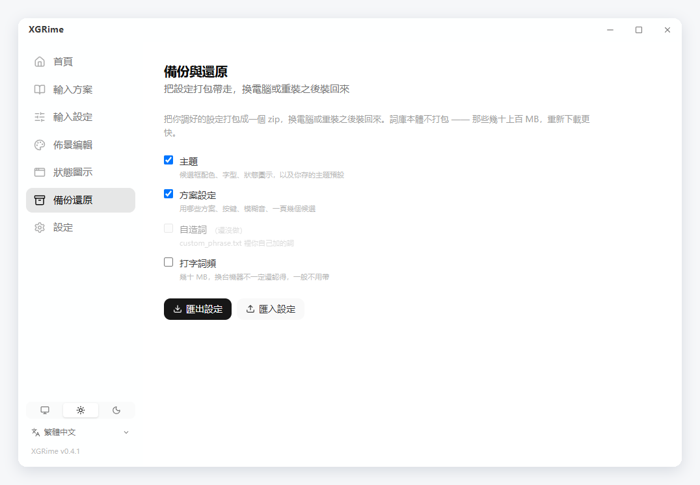

[English](README.md) | [官话 - 简体中文](README-cmn_CN.md) | 官話 - 繁體中文 | [廣東話](README-jyut.md)

<br>

<p align='center'>
  
</p>

<h1 align='center'>XGRime</h1>

<p align='center'>
  <samp>RIME 輸入法的圖形設定工具 —— 安裝輸入法、挑輸入方案、調外觀，按幾下就好</samp>
</p>

<p align='center'>
  
  
  
  
  
  
  
</p>

<p align='center'>
  <a href="https://github.com/XXGGG/XGRime/releases/latest"><b>下載最新版</b></a>
</p>

<br>

## 👋 簡介

RIME 是桌面上最強的輸入法引擎之一，但它的設定全靠手寫 YAML —— 換個輸入方案要自己
下載詞庫，調個候選框顏色要翻文件裡的十幾個鍵名。

XGRime 把這些接手過來：**安裝輸入法、挑輸入方案、調按鍵習慣、改候選框外觀**，
全部在圖形介面裡完成，設定檔由它替你寫。

支援 Windows 的**小狼毫（Weasel）**與 macOS 的**鼠鬚管（Squirrel）**。

<div align="center">
  
</div>

## ✨ 功能

### 安裝與維護

- 自動偵測輸入法裝了沒，沒裝可一鍵下載官方安裝檔並啟動安裝
- 官方發佈新版本時提示更新
- 可以解除安裝輸入法，也可以把移除後殘留的舊設定備份歸檔

### 28 個輸入方案

| 分類 | 方案 |
|---|---|
| 官話 | 霧凇拼音、薄荷拼音、朙月拼音、袖珍簡化字拼音、地球拼音 |
| 雙拼 | 小鶴、微軟、自然碼、智慧 ABC、拼音加加 |
| 粵語 | 粵語拼音（詞庫來自粵典 words.hk）、耶魯粵拼、香港教院式 |
| 注音 | 注音、注音 · 臺灣正體 |
| 形碼 | 五筆 86、五筆 · 拼音、倉頡五代、速成、快速倉頡、五筆畫、行列 30 |
| 進階 | 上海吳語、蘇州吳語、中古全拼、X-SAMPA 音標、宮保拼音 |

- 按「按讀音打 / 按字形打 / 進階」分層，新手在推薦區三選一即可
- 一鍵安裝，方案相依的詞典會一併裝齊並自動啟用
- 隨時啟用、停用、解除安裝；可檢查詞庫有沒有更新

<div align="center">
  
</div>

### 輸入設定

- 候選字個數、翻頁鍵、左右 Shift 鍵行為
- 模糊音 11 組（zh/z、n/l、an/ang 等）
- 方案自帶的開關：繁簡字形、中英標點、Emoji 候選等，有幾個顯示幾個
- 裝了多個方案時分別設定，互不影響

<div align="center">
  
</div>

### 外觀

- **20 套預設**：出廠兩套（XGRime 淺色 / 深色），另有小狼毫官方配色（碧水、墨池、
  孤寺、暗堂、曬經石、星際爭霸）、微軟輸入法風格、macOS 原生、Windows 11、緊湊、
  直排經典，以及 Nord、Dracula、Tokyo Night、Catppuccin
- 預設的縮圖**是小狼毫真畫出來的候選框截圖**，不是示意圖
- 配色、字型、字級、圓角、邊距、寬度全部可調，調好的可以存成自己的預設
- 切換中英文時彈出的提示可以關掉或調短

<div align="center">
  
</div>

### 狀態圖示

- 內建四套「中 / A / 全 / 半」：黑字、白字、藍底白字、深底白字
- **自動**：工作列深色就用白字那套、淺色就用黑字那套，開機時自動對一次
- 四個狀態也可以各自換成自己的圖片

<div align="center">
  
</div>

### 備份與還原

- 把主題、方案設定、狀態圖示、存下的預設打包成一個 zip，換電腦或重灌之後裝回來
- 詞庫本體不打包 —— 那些幾十上百 MB，重新下載更快
- 匯入前先讀包裡的清單彈確認；被覆寫的檔案會先抄一份留在設定目錄

<div align="center">
  
</div>

### 系統匣與設定

- 關閉視窗只收進系統匣不結束；點系統匣圖示能換輸入方案、重新部署
- 開機自動啟動；Windows 上可以一鍵開啟系統的「進階鍵盤設定」

### 介面

- 繁體中文、簡體中文、廣東話、English，第一次開啟跟隨系統語言
- 跟隨系統 / 淺色 / 深色

## 💡 有什麼不一樣

**不會把你的設定弄丟。** XGRime 只寫屬於自己那一層設定，從不覆寫輸入法或詞庫自帶的
檔案。升級輸入法、更新詞庫之後，你調過的東西都還在。

**裝完就能用。** 輸入方案常常相依於別的詞典，少一本部署就會失敗。XGRime 會把相依
一併裝齊、自動掛進方案清單，裝完直接切過去就能打字。

**看到的就是真的。** 主題預設的縮圖不是畫出來的示意圖 —— 每一套都真的部署了一遍，
再把小狼毫自己畫出來的候選框抓下來。挑的時候看到什麼，用起來就是什麼。

## 🚀 開始使用

1. 到 [Releases](https://github.com/XXGGG/XGRime/releases/latest) 下載安裝檔並安裝
2. 開啟 XGRime，在**首頁**裝上小狼毫 / 鼠鬚管（已經裝過會自動認出來）
3. 到**輸入方案**挑一個，新手在推薦區三選一就行
4. 裝了多個方案的話，在**輸入方案**頁上面點一下就能換；打字時也可以按
   <kbd>Ctrl</kbd> + <kbd>`</kbd> 切

系統需求：Windows 10/11 或 macOS 12+。

## 🛠 從原始碼建置

```bash
pnpm install
pnpm tauri dev      # 開發
pnpm tauri build    # 打包安裝檔
```

需要 Node.js 18+、pnpm 與 Rust 1.77+。Windows 另需 MSVC 建置工具與 WebView2
（Windows 11 內建）。

## 📁 專案結構

```
src/views/                  首頁 / 輸入方案 / 輸入設定 / 佈景編輯
src/components/theme/       候選框預覽、取色、字型、預設、狀態圖示
src/i18n/locales/           繁 / 簡 / 粵 / EN 四份，建置時檢查鍵一一對應
src-tauri/src/platform.rs   Windows / macOS 抽象層：偵測、設定資料夾、部署
src-tauri/src/dict.rs       方案清單與相依、下載解壓、啟用停用
src-tauri/src/settings.rs   輸入設定與方案開關
src-tauri/src/config.rs     外觀設定的讀寫
```

## 🙏 鳴謝

**上游** —— [RIME / 中州韻輸入法引擎](https://rime.im)，以及
[小狼毫 Weasel](https://github.com/rime/weasel) 與
[鼠鬚管 Squirrel](https://github.com/rime/squirrel)。XGRime 只是替它們做設定。

**輸入方案** —— [霧凇拼音](https://github.com/iDvel/rime-ice)、
[薄荷拼音](https://github.com/Mintimate/oh-my-rime)、
[粵語拼音](https://github.com/rime/rime-cantonese)，以及官方的 `rime/rime-*`
方案倉庫。詞庫在安裝時下載，並未打包進本倉庫。

**技術堆疊** —— [Tauri](https://tauri.app)、[Vue](https://vuejs.org)、
[Tailwind CSS](https://tailwindcss.com)、[Pinia](https://pinia.vuejs.org)、
[VueUse](https://vueuse.org)、[Lucide](https://lucide.dev)。

README 版式參考 [vitesse](https://github.com/antfu-collective/vitesse) 與
[BewlyBewly](https://github.com/BewlyBewly/BewlyBewly)，只參考版式，未使用其程式碼。

## 授權條款

本專案採用 [MIT](LICENSE) 授權條款。

Copyright © 2026 [Xie Xiage](https://github.com/XXGGG)
