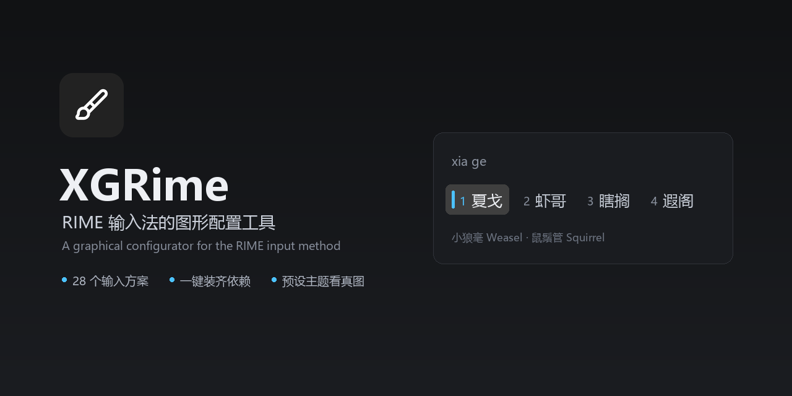
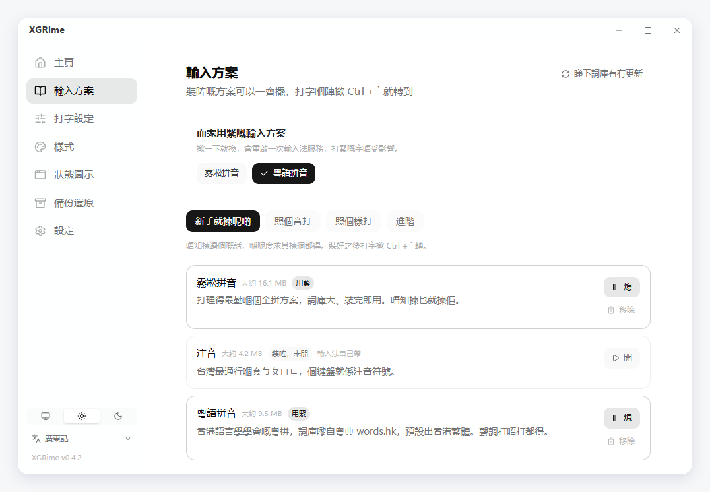
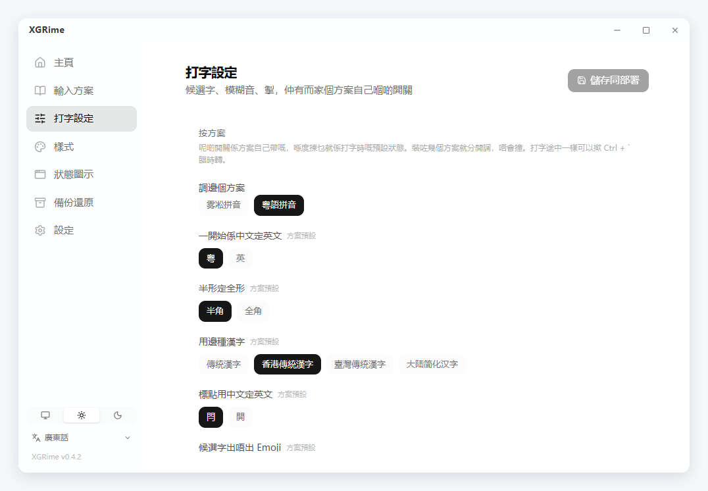
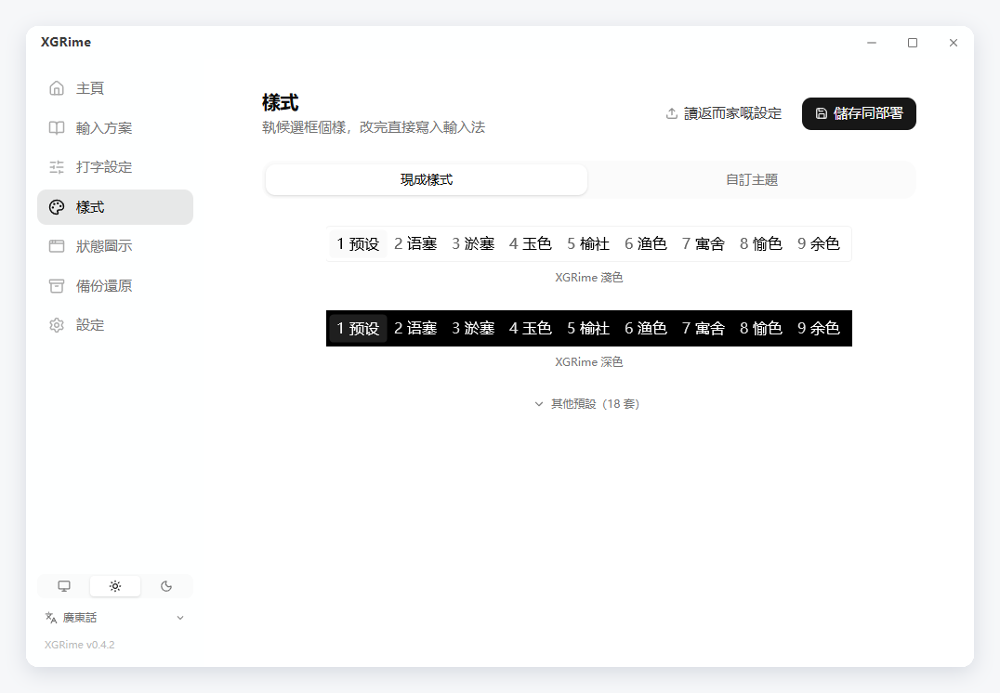
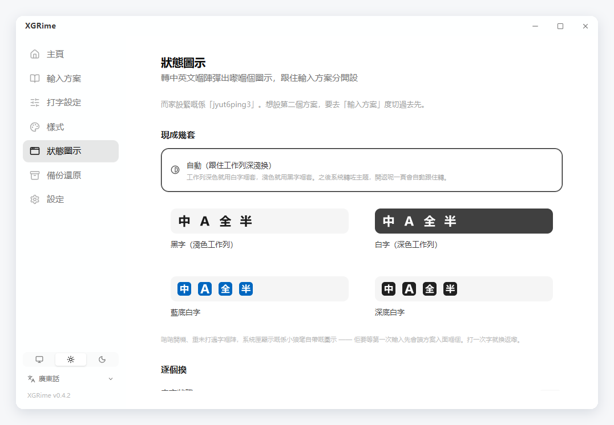
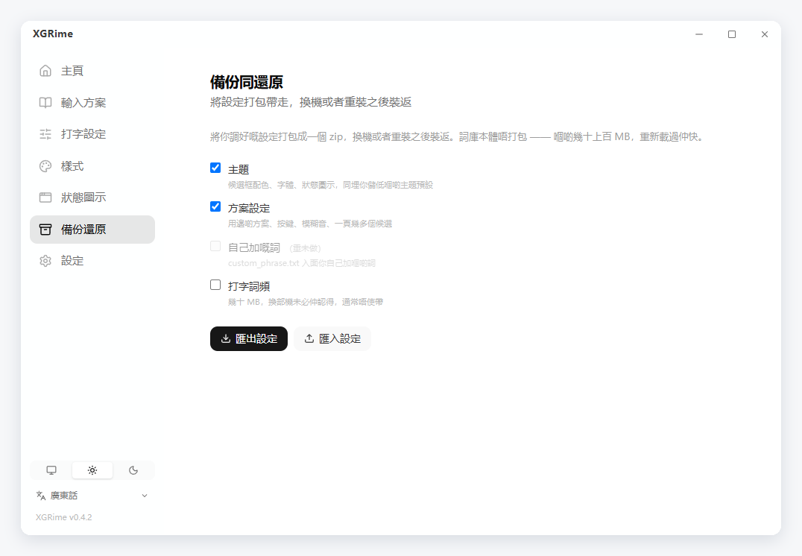

[English](README.md) | [官话 - 简体中文](README-cmn_CN.md) | [官話 - 繁體中文](README-cmn_TW.md) | 廣東話

<br>

<p align='center'>
  
</p>

<h1 align='center'>XGRime</h1>

<p align='center'>
  <samp>RIME 輸入法嘅圖形設定工具 —— 裝輸入法、揀輸入方案、執外觀，撳幾下就搞掂</samp>
</p>

<p align='center'>
  
  
  
  
  
  
  
</p>

<p align='center'>
  <a href="https://github.com/XXGGG/XGRime/releases/latest"><b>落載最新版</b></a>
</p>

<br>

## 👋 呢個係乜

RIME 係枱面上最打得嘅輸入法引擎之一，不過佢啲設定全部要自己搣 YAML —— 想換個輸入
方案要自己落載詞庫，想調個候選框顏色要揭文件搵十幾個鍵名。

XGRime 幫你接手晒：**裝輸入法、揀輸入方案、執按鍵習慣、改候選框外觀**，
全部喺圖形介面度做完，啲設定檔佢幫你寫。

Windows 嘅**小狼毫（Weasel）**同 macOS 嘅**鼠鬚管（Squirrel）**都用得。

<div align="center">
  
</div>

## ✨ 有咩功能

### 裝同維護

- 自動睇下輸入法裝咗未，未裝可以一撳落載官方安裝檔再幫你開
- 官方出新版就提你更新
- 可以移除輸入法，亦可以將移除之後留低嘅舊設定備份收埋

### 28 個輸入方案

| 分類 | 方案 |
|---|---|
| 官話 | 霧凇拼音、薄荷拼音、朙月拼音、袖珍簡化字拼音、地球拼音 |
| 雙拼 | 小鶴、微軟、自然碼、智能 ABC、拼音加加 |
| 粵語 | 粵語拼音（詞庫嚟自粵典 words.hk）、耶魯粵拼、香港教院式 |
| 注音 | 注音、注音 · 臺灣正體 |
| 形碼 | 五筆 86、五筆 · 拼音、倉頡五代、速成、快速倉頡、五筆畫、行列 30 |
| 進階 | 上海吳語、蘇州吳語、中古全拼、X-SAMPA 音標、宮保拼音 |

- 照「照個音打 / 照個樣打 / 進階」分層，新手喺推薦區三揀一就得
- 一撳裝，方案要用嘅詞典會一齊裝埋，仲會自動開返
- 想開就開、想熄就熄、想移除就移除；仲可以查下詞庫有冇更新

<div align="center">
  
</div>

### 打字設定

- 候選字個數、揭頁掣、左右 Shift 掣點用
- 模糊音 11 組（zh/z、n/l、an/ang 等等）
- 方案自己帶嘅開關：繁簡字形、中英標點、Emoji 候選，有幾多就顯示幾多
- 裝咗幾個方案就分開設，唔會撞

<div align="center">
  
</div>

### 外觀

- **20 套現成樣式**：出廠兩套（XGRime 淺色 / 深色），仲有小狼毫官方配色（碧水、
  墨池、孤寺、暗堂、曬經石、星際爭霸）、微軟輸入法個樣、macOS 原生、Windows 11、
  細框、直排經典，同 Nord、Dracula、Tokyo Night、Catppuccin
- 每套嘅縮圖**係小狼毫真係畫出嚟嗰個候選框嘅截圖**，唔係示意圖
- 配色、字體、字級、圓角、留白、闊度全部調得，執靚咗可以存做自己嘅預設
- 轉中英文嗰陣彈出嗰個提示，可以熄咗或者調短

<div align="center">
  
</div>

### 狀態圖示

- 內建四套「中 / A / 全 / 半」：黑字、白字、藍底白字、深底白字
- **自動**：工作列深色就用白字嗰套、淺色就用黑字嗰套，開機自動對一次
- 四個狀態都可以各自換做自己張圖

<div align="center">
  
</div>

### 備份同還原

- 將主題、方案設定、狀態圖示、儲低嘅預設打包成一個 zip，換機或者重裝之後裝返
- 詞庫本體唔打包 —— 嗰啲幾十上百 MB，重新載過仲快
- 匯入之前會讀個清單彈確認；會被冚嘅檔案，先抄一份留喺設定資料夾

<div align="center">
  
</div>

### 系統匣同設定

- 閂窗口只係收埋入系統匣，唔會熄；撳系統匣個圖示可以換輸入方案、重新部署
- 開機自動啟動；Windows 上面可以一撳開系統嘅「進階鍵盤設定」

### 介面

- 廣東話、繁體中文、簡體中文、English，第一次開會跟你部機嘅語言
- 跟部機 / 淺色 / 深色

## 💡 同人哋有咩唔同

**唔會整跌你啲設定。** XGRime 淨係寫自己嗰層設定，唔會冚輸入法或者詞庫自己帶嘅檔案。
升級輸入法、更新詞庫之後，你執過嘅嘢全部仲喺度。

**裝完即刻用得。** 輸入方案好多時要靠第二啲詞典，爭一本部署就會失敗。XGRime 會將
啲依賴一齊裝埋、自動掛入方案清單，裝完轉過去就打得字。

**睇到嘅就係真嘢。** 主題預設嘅縮圖唔係畫出嚟嘅示意圖 —— 每一套都真係部署過一次，
再將小狼毫自己畫出嚟嗰個候選框抓落嚟。揀嗰陣見到乜，用起上嚟就係乜。

## 🚀 點樣開始

1. 去 [Releases](https://github.com/XXGGG/XGRime/releases/latest) 落載安裝檔裝好
2. 開 XGRime，喺**主頁**裝返小狼毫 / 鼠鬚管（裝過嘅會自動認得出）
3. 去**輸入方案**揀一個，新手喺推薦區三揀一就得
4. 裝咗幾個方案嘅話，喺**輸入方案**個頁面上面撳一下就轉到；打字嗰陣都可以撳
   <kbd>Ctrl</kbd> + <kbd>`</kbd>

要 Windows 10/11 或者 macOS 12+。

## 🛠 自己砌

```bash
pnpm install
pnpm tauri dev      # 開發
pnpm tauri build    # 打安裝檔
```

要 Node.js 18+、pnpm 同 Rust 1.77+。Windows 仲要 MSVC 建置工具同 WebView2
（Windows 11 本身就有）。

## 📁 有咩檔案

```
src/views/                  主頁 / 輸入方案 / 打字設定 / 樣式
src/components/theme/       候選框預覽、揀色、字體、預設、狀態圖示
src/i18n/locales/           粵 / 繁 / 簡 / EN 四份，砌嗰陣會查啲鍵啱唔啱數
src-tauri/src/platform.rs   Windows / macOS 抽象層：偵測、設定資料夾、部署
src-tauri/src/dict.rs       方案清單同依賴、落載解壓、開關
src-tauri/src/settings.rs   打字設定同方案開關
src-tauri/src/config.rs     外觀設定嘅讀寫
```

## 🙏 多謝

**上游** —— [RIME / 中州韻輸入法引擎](https://rime.im)，仲有
[小狼毫 Weasel](https://github.com/rime/weasel) 同
[鼠鬚管 Squirrel](https://github.com/rime/squirrel)。XGRime 淨係幫佢哋做設定咋。

**輸入方案** —— [霧凇拼音](https://github.com/iDvel/rime-ice)、
[薄荷拼音](https://github.com/Mintimate/oh-my-rime)、
[粵語拼音](https://github.com/rime/rime-cantonese)，同官方嗰啲 `rime/rime-*`
方案倉。啲詞庫係裝嗰陣先落載，冇打包入呢個倉。

**用咗啲乜砌** —— [Tauri](https://tauri.app)、[Vue](https://vuejs.org)、
[Tailwind CSS](https://tailwindcss.com)、[Pinia](https://pinia.vuejs.org)、
[VueUse](https://vueuse.org)、[Lucide](https://lucide.dev)。

README 個版式參考咗 [vitesse](https://github.com/antfu-collective/vitesse) 同
[BewlyBewly](https://github.com/BewlyBewly/BewlyBewly)，淨係參考版式，冇抄人哋嘅碼。

## 牌照

呢個項目用 [MIT](LICENSE) 牌照。

Copyright © 2026 [Xie Xiage](https://github.com/XXGGG)
