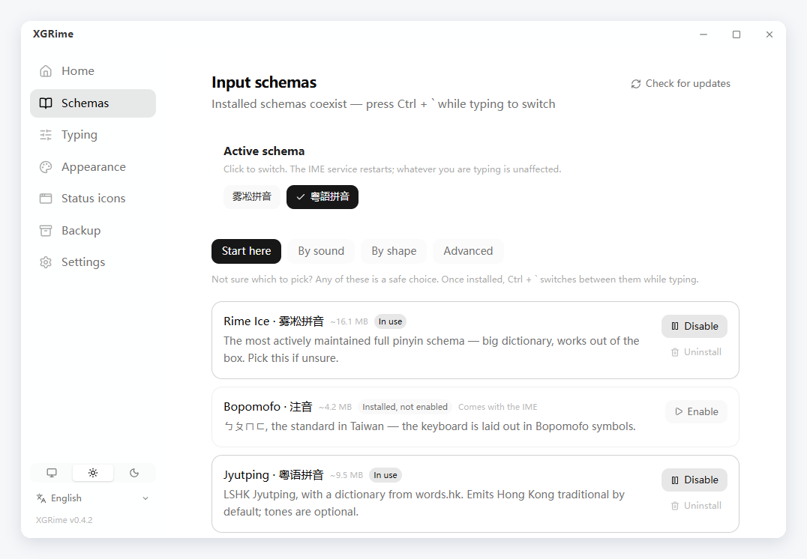
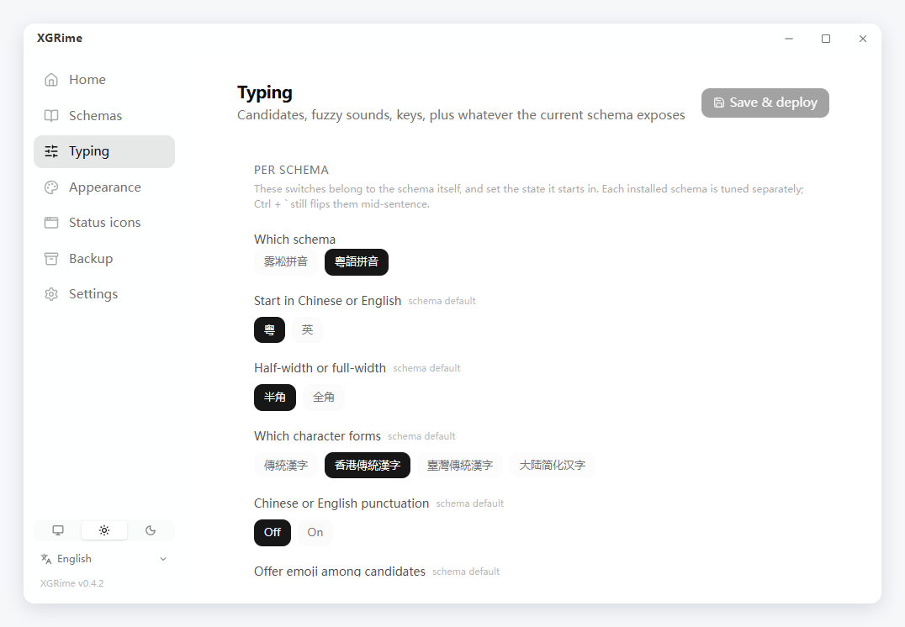
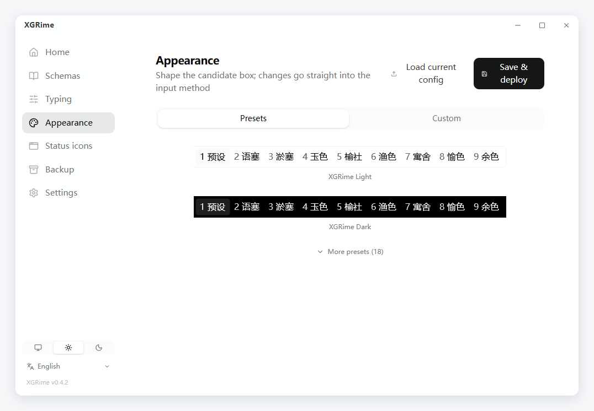
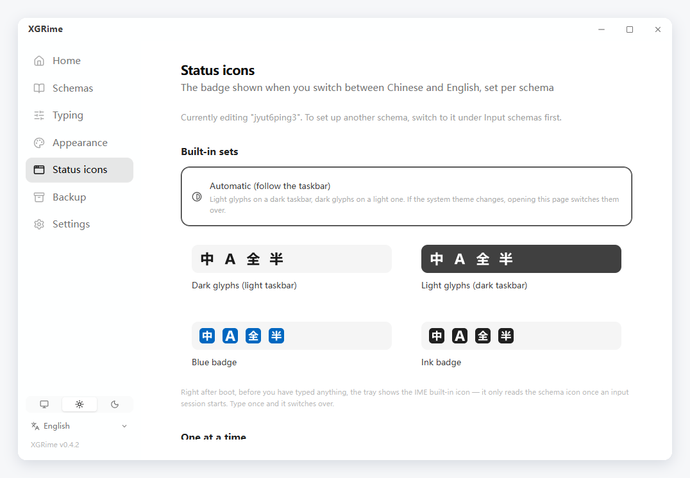
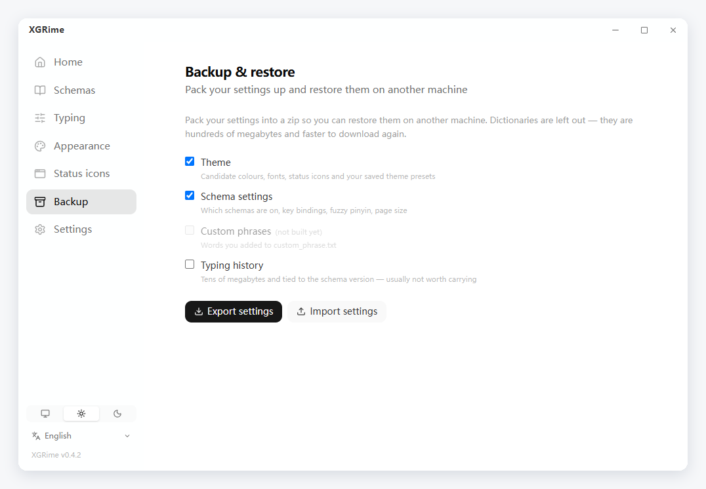

English | [官话 - 简体中文](README-cmn_CN.md) | [官話 - 繁體中文](README-cmn_TW.md) | [廣東話](README-jyut.md)

<br>

<p align='center'>
  
</p>

<h1 align='center'>XGRime</h1>

<p align='center'>
  <samp>A graphical configurator for the RIME input method — install it, pick a schema, restyle the candidate box, all in a few clicks</samp>
</p>

<p align='center'>
  
  
  
  
  
  
  
</p>

<p align='center'>
  <a href="https://github.com/XXGGG/XGRime/releases/latest"><b>Download</b></a>
</p>

<br>

## 👋 Introduction

RIME is one of the most capable input method engines on the desktop, but everything
about it is configured by hand-writing YAML — switching schemas means downloading
dictionaries yourself, and recolouring the candidate box means looking up a dozen
key names in the docs.

XGRime takes that over: **install the input method, pick a schema, tune your typing
habits, restyle the candidate box** — all from a window, with the config files
written for you.

Works with **Weasel (小狼毫)** on Windows and **Squirrel (鼠鬚管)** on macOS.

<div align="center">
  
</div>

## ✨ Features

### Install and maintain

- Detects whether the input method is installed; if not, downloads the official
  installer and launches it
- Tells you when a newer official release is out
- Uninstalls the input method, and can archive leftover config from a previous install

### 28 input schemas

| Category | Schemas |
|---|---|
| Mandarin | Rime Ice, Mint, Luna Pinyin, Pocket Simplified, Terra Pinyin |
| Double pinyin | Flypy, Microsoft, Ziranma, Intelligent ABC, Pinyin Jiajia |
| Cantonese | Jyutping (dictionary from words.hk), Yale, HK Education |
| Bopomofo | Bopomofo, Bopomofo · Taiwan standard |
| Shape-based | Wubi 86, Wubi + Pinyin, Cangjie 5, Quick, Smart Cangjie, Strokes, Array 30 |
| Advanced | Shanghainese, Suzhou Wu, Middle Chinese, X-SAMPA, Combo Pinyin |

- Sorted by *how you type* — by sound, by shape, advanced — with a three-item
  "start here" panel for newcomers
- One click installs a schema together with every dictionary it depends on, and
  enables it for you
- Enable, disable or uninstall at any time; check whether dictionaries have updates

<div align="center">
  
</div>

### Typing

- Candidate count, paging keys, left and right Shift behaviour
- Eleven fuzzy-sound pairs (zh/z, n/l, an/ang and so on)
- Whatever switches the schema itself declares — simplified/traditional, punctuation
  style, emoji candidates — listed as the schema defines them
- Each installed schema is tuned separately

<div align="center">
  
</div>

### Appearance

- **20 presets**: two shipped defaults (XGRime Light / Dark), plus Weasel's own
  colour schemes (Aqua, Ink, Lost Temple, Dark Temple, Solarized Rock, StarCraft),
  a Microsoft IME look, macOS, Windows 11, Compact, Classic vertical, and Nord,
  Dracula, Tokyo Night and Catppuccin
- Every preset thumbnail **is a screenshot of the real candidate box**, drawn by
  the IME itself — not an illustration
- Colours, fonts, size, corner radius, padding and width are all adjustable, and
  what you end up with can be saved as your own preset
- The popup shown when switching between Chinese and English can be turned off
  or shortened

<div align="center">
  
</div>

### Status icons

- Four built-in sets of Chinese / A / full-width / half-width badges: dark glyphs,
  light glyphs, blue badge, ink badge
- **Automatic**: light glyphs on a dark taskbar, dark glyphs on a light one,
  re-checked at every launch
- Each of the four states can also be swapped for your own image

<div align="center">
  
</div>

### Backup & restore

- Packs your theme, schema settings, status icons and saved presets into a zip so
  you can restore them on another machine
- Dictionaries are left out — they are hundreds of megabytes and faster to download
  again
- Import reads the manifest and asks for confirmation first; anything it overwrites
  is copied aside into the config folder

<div align="center">
  
</div>

### Tray & settings

- Closing the window tucks XGRime into the tray instead of quitting; the tray menu
  switches schema and redeploys
- Start with Windows, and a shortcut to the system's advanced keyboard settings

### Interface

- English, 简体中文, 繁體中文 and 廣東話 — follows your system language on first run
- Follow system / light / dark

## 💡 What makes it different

**It will not lose your settings.** XGRime only ever writes its own configuration
layer and never overwrites files that ship with the input method or a dictionary.
Upgrade either one and everything you tuned is still there.

**Schemas work the moment they finish installing.** A schema usually depends on other
dictionaries, and deployment fails if one is missing. XGRime pulls in the whole set
and switches the schema on, so you can start typing straight away.

**What you see is the real thing.** Preset thumbnails are not illustrations — each
one was actually deployed and the candidate box the IME drew was captured. What you
pick is exactly what you get.

## 🚀 Getting started

1. Download and run the installer from [Releases](https://github.com/XXGGG/XGRime/releases/latest)
2. Open XGRime and install Weasel / Squirrel from the **Home** tab (an existing
   installation is detected automatically)
3. Pick a schema under **Schemas** — anything in the "start here" panel is a safe choice
4. With more than one schema installed, switch from the top of the **Schemas**
   page, or press <kbd>Ctrl</kbd> + <kbd>`</kbd> while typing

Requires Windows 10/11 or macOS 12+.

## 🛠 Building from source

```bash
pnpm install
pnpm tauri dev      # develop
pnpm tauri build    # produce an installer
```

Needs Node.js 18+, pnpm and Rust 1.77+. On Windows you also need the MSVC build
tools and WebView2 (shipped with Windows 11).

## 📁 Layout

```
src/views/                  Home / Schemas / Typing / Appearance
src/components/theme/       preview, colour picker, fonts, presets, status icons
src/i18n/locales/           EN / 简 / 繁 / 粵 — key parity enforced at build time
src-tauri/src/platform.rs   Windows / macOS abstraction: detect, config dir, deploy
src-tauri/src/dict.rs       schema catalogue and dependencies, download, enable
src-tauri/src/settings.rs   typing settings and schema switches
src-tauri/src/config.rs     reading and writing the appearance config
```

## 🙏 Credits

**Upstream** — [RIME / 中州韻輸入法引擎](https://rime.im), plus
[Weasel](https://github.com/rime/weasel) and
[Squirrel](https://github.com/rime/squirrel). XGRime only configures them.

**Schemas** — [Rime Ice](https://github.com/iDvel/rime-ice),
[Mint](https://github.com/Mintimate/oh-my-rime),
[rime-cantonese](https://github.com/rime/rime-cantonese) and the official
`rime/rime-*` repositories. Dictionaries are downloaded at install time, not
vendored here.

**Built with** — [Tauri](https://tauri.app), [Vue](https://vuejs.org),
[Tailwind CSS](https://tailwindcss.com), [Pinia](https://pinia.vuejs.org),
[VueUse](https://vueuse.org), [Lucide](https://lucide.dev).

README layout follows [vitesse](https://github.com/antfu-collective/vitesse) and
[BewlyBewly](https://github.com/BewlyBewly/BewlyBewly) — layout only, no code taken.

## License

[MIT](LICENSE).

Copyright © 2026 [Xie Xiage](https://github.com/XXGGG)
